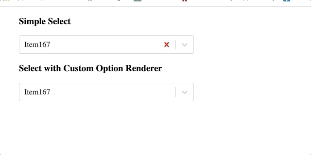

# Select using react-window
An alternate to react-virtualized-select which is no longer supported. 
This uses the react-window's FixedSizeList and react-select 2.0. It currently only supports fixed size menu list for a select item. 

## Demos

Here are a few [examples](https://cryptic-plains-61029.herokuapp.com/)

## Getting Started
* Install `react-window-select` through npm

```
npm install react-virtualized-select --save
```

## Example
react-window-select works just like react-select. You pass it an array of options, along with almost any other parameters supported by the Select component.
``` 
  import { WindowSelect } from 'react-window-select';

  <WindowSelect
    options={options}
    value={{ value: 'Item167', label: 'Item167' }}
    onChange={this._onChange}
    isClearable={true}
    styles={{ clearIndicator: ClearIndicatorStyles }}
  />
```
